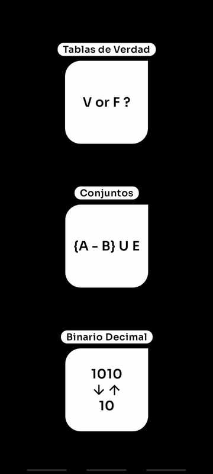
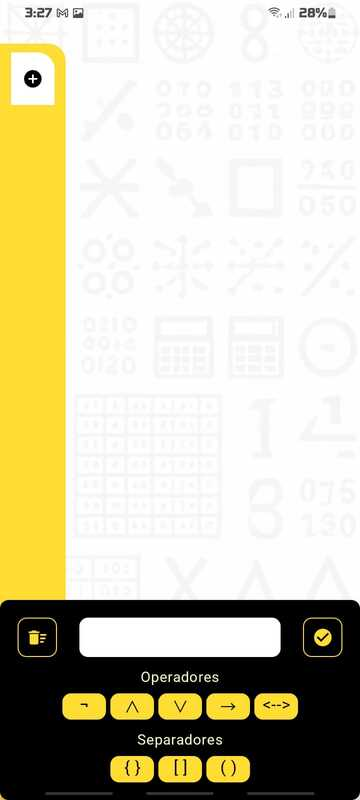

# Diseño de aplicación movil multiobjetivo, orientada al uso de las Matemáticas Discretas.

Esta aplicación cubre las áreas de las Matemáticas Discretas como:
Operaciones de conjuntos, Operaciones con operadores lógicos y transformaciones númericas.

## Screenshots

## Features

- *Se implemento el patrón de diseño MVVM, el cual garantizo a este proyecto una excelente relación entre la interfaz grafica y el ViewModel. Siendo la UI desarrollada con el kit de herramientas Jetpack Compose.*

- *Para el diseño de esta app, con el fin de hacerla escalar y sostenible se implemento una ***Arquitectura de software*** tipo, Clean Architecture*

- ***Ejecuta operaciones de conjuntos que contengan:*** [ Unión, Intersección, Diferencia, Vacío, Subconjunto ]

- ***Ejecuta operaciones con operadores lógicos que contengan:*** [ Negación, Conjunción, Disyunción, Condicional, Bicondicional ]

- ***Transformación númerica:*** Permite la Transformación de un número. Decimal a: [ Binario, Octal, Hexadecimal ]. Binario a: [ Decimal, Octal, Hexadecimal ]. Octal a: [ Binario, Decimal, Hexadecimal ]. Hexadecimal a: [ Binario, Octal, Decimal ]

## Authors

- [@Zheilon](https://www.github.com/Zheilon)

## Tech Stack

**Lenguage de codificación:** Kotlin 2.0.0

**UI:** Jetpack Compose

